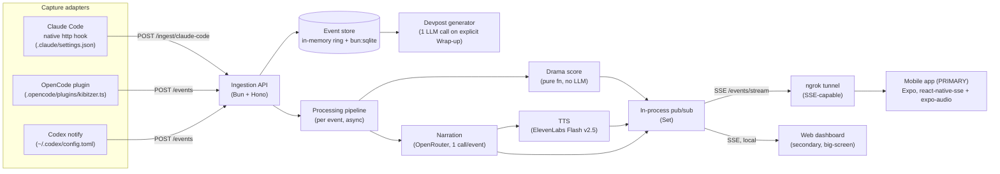

# Kibitzer — Architecture

## System diagram



> **Primary delivery is the mobile app**, reached over an ngrok tunnel (Cloudflare quick
> tunnels don't support SSE — see `mobile-app.md`). The web dashboard is a secondary
> big-screen view on the same endpoints. Push is cut this build.

## Repository layout

Bun workspaces monorepo. Adapters and server share the canonical schema + classifier via a
`shared` package so the contract lives in one version-controlled place (per project rule:
"prompts, schemas, and tool definitions live in version-controlled files").

```
kibitzer/
├─ package.json                 # workspaces: ["packages/*", "apps/*"]
├─ .env                         # git-ignored; see README
├─ packages/
│  ├─ shared/                   # imported by server AND adapters
│  │  └─ src/
│  │     ├─ event.ts            # KibitzerEvent types + zod schema
│  │     ├─ classify.ts         # isDestructive()
│  │     ├─ drama.ts            # dramaScore(), shouldNarrate() pure fns
│  │     └─ describe.ts         # describeEvent(), templatedFallback()
│  └─ server/
│     └─ src/
│        ├─ index.ts            # Bun.serve + Hono app wiring
│        ├─ routes/
│        │  ├─ events.ts        # POST /events, POST /ingest/claude-code
│        │  ├─ stream.ts        # GET /events/stream (SSE)
│        │  ├─ analytics.ts     # GET /session/:id/analytics
│        │  ├─ tts.ts           # GET /api/tts (audio proxy)
│        │  ├─ devpost.ts       # POST /session/:id/end, GET /session/:id/devpost
│        │  └─ persona.ts       # GET/PUT /persona
│        ├─ pipeline.ts         # runPipeline(event): debounce→drama→narrate→tts→broadcast
│        ├─ bus.ts             # Set<SSEStreamingApi> pub/sub, broadcast()
│        ├─ store.ts            # bun:sqlite + in-memory ring buffer
│        ├─ narrate.ts          # OpenRouter call
│        ├─ tts.ts              # ElevenLabs call
│        └─ devpost.ts          # one-shot transcript summariser
├─ adapters/
│  ├─ claude-code/settings.json # drop into a target repo's .claude/
│  ├─ opencode/kibitzer.ts      # drop into a target repo's .opencode/plugins/ (must be
│  │                            #   self-contained: it runs in ANOTHER repo, so it cannot
│  │                            #   import packages/shared — inline the tiny bits it needs)
│  └─ codex/notify.js           # referenced from ~/.codex/config.toml (also self-contained)
└─ apps/
   ├─ mobile/                   # Expo (React Native) — PRIMARY interface; see mobile-app.md
   └─ dashboard/                # Vite + React + Tailwind — secondary big-screen view
```

> No `push.ts` — push is cut this build (§6). The `apps/mobile` internals (SSE hook, audio
> queue, pairing, screens) are specified in `mobile-app.md`, not here.

## Components

### 1. Capture adapters
Each adapter only translates a native event into the canonical schema (see
`event-schema.md`) and POSTs it. No business logic. Claude Code posts its *own* payload to
`/ingest/claude-code` (server normalizes); OpenCode and Codex adapters are our code and emit
the canonical shape directly to `/events`.

### 2. Ingestion API (Bun + Hono)
See `api-reference.md` for full request/response contracts. Routes:

- `POST /events` — validate (zod) one canonical `KibitzerEvent`; on success store it and
  kick `runPipeline(event)` **without awaiting** (return `202` immediately so the adapter's
  request is never blocked).
- `POST /ingest/claude-code` — accept a raw Claude Code hook body, normalize to canonical,
  then flow through the same store + pipeline path. Always returns fast `2xx`.
- `GET /events/stream` — SSE; registers the client stream in the pub/sub `Set`.
- `GET /session/:id/analytics` — aggregate the store into the Analytics tab shape.
- `POST /session/:id/end` — runs the devpost generator over the full transcript, caches and
  returns `{ post, tweetThread }`. Explicit trigger only (dashboard "Wrap up session"
  button); re-POST regenerates. **Not** auto-fired by per-turn session-end events (§8).
- `GET /session/:id/devpost` — returns the cached devpost + tweet draft (or `404` if not
  generated yet).
- `GET /persona`, `PUT /persona` — shared persona state (dashboard + mobile read/write it).
- `GET /api/tts?eventId=…` — streams `audio/mpeg` for a narrated line (proxy, §7).

### 3. Event store (`store.ts`)
- **In-memory ring buffer of `FeedItem[]`** (capped ~2000) for the active session — the hot
  path for SSE replay-on-connect and analytics aggregation. The ring holds `FeedItem`
  (event + dramaScore + narration + audioUrl), not bare events, so `replay` frames and
  `dramaScore`'s `scores[]` input both come straight from it.
- **`bun:sqlite`** for persistence across restarts and for the devpost generator to read the
  full transcript. WAL mode on. `detail` stored as JSON `TEXT` (SQLite has no JSON column
  type — `JSON.stringify` on write, `JSON.parse` on read).

```sql
-- events table (created on boot, idempotent)
CREATE TABLE IF NOT EXISTS events (
  id          TEXT PRIMARY KEY,
  sessionId   TEXT NOT NULL,
  source      TEXT NOT NULL,
  type        TEXT NOT NULL,
  timestamp   TEXT NOT NULL,
  detail      TEXT NOT NULL,          -- JSON.stringify(KibitzerEventDetail), incl. isDestructive
  dramaScore  INTEGER,                -- filled by pipeline step 1, nullable until scored
  narration   TEXT,                   -- filled after LLM call, nullable
  audioReady  INTEGER DEFAULT 0       -- 1 once TTS mp3 exists on disk
);
CREATE INDEX IF NOT EXISTS idx_events_session ON events(sessionId, timestamp);

-- one row per session, upserted on first event; devpost cached at end
CREATE TABLE IF NOT EXISTS sessions (
  id         TEXT PRIMARY KEY,
  startedAt  TEXT,
  endedAt    TEXT,
  devpost    TEXT                      -- JSON { post: string, tweetThread: string[] }
);
```

> Persona is **global** (single-session demo) — held in memory in `persona.ts`, not per-row.
> A `sessions` row is upserted on the first event of a session so `durationMs` (from
> `startedAt`) and the devpost cache have a home.

```ts
// store.ts — bun:sqlite usage (verified API)
import { Database } from "bun:sqlite";
const db = new Database(process.env.KIBITZER_DB ?? "kibitzer.sqlite", { create: true });
db.run("PRAGMA journal_mode = WAL;");

const insert = db.query(
  `INSERT OR IGNORE INTO events (id, sessionId, source, type, timestamp, detail)
   VALUES ($id, $sessionId, $source, $type, $timestamp, $detail)`
);
const upsertSession = db.query(
  `INSERT INTO sessions (id, startedAt) VALUES ($id, $ts)
   ON CONFLICT(id) DO NOTHING`
);
const patchEvent = db.query(
  `UPDATE events SET dramaScore = COALESCE($dramaScore, dramaScore),
                     narration  = COALESCE($narration, narration),
                     audioReady = COALESCE($audioReady, audioReady)
   WHERE id = $id`
);

const ring: FeedItem[] = [];

export function saveEvent(e: KibitzerEvent): void {
  insert.run({ $id: e.id, $sessionId: e.sessionId, $source: e.source,
    $type: e.type, $timestamp: e.timestamp, $detail: JSON.stringify(e.detail) });
  upsertSession.run({ $id: e.sessionId, $ts: e.timestamp });
}

// Called at each pipeline stage to back-write scores/narration/audio.
export function updateEvent(id: string, patch: Partial<Pick<FeedItem, "dramaScore" | "narration" | "audioUrl">>): void {
  patchEvent.run({
    $id: id,
    $dramaScore: patch.dramaScore ?? null,
    $narration: patch.narration ?? null,
    $audioReady: patch.audioUrl ? 1 : null,
  });
  const item = ring.find((f) => f.event.id === id);
  if (item) Object.assign(item, patch);
}

export function pushFeedItem(item: FeedItem): void {
  ring.push(item); if (ring.length > 2000) ring.shift();
}
export const getRing = (): readonly FeedItem[] => ring;
export const activeSessionId = (): string | null => ring.at(-1)?.event.sessionId ?? null;
export const recentBefore = (id: string) => {
  const i = ring.findIndex((f) => f.event.id === id);
  return i === -1 ? ring.slice() : ring.slice(0, i); // PRIOR items only
};
```

### 4. Processing pipeline (`pipeline.ts`)
`runPipeline(event)` runs once per event, fully async, never blocking ingestion. The route
calls `saveEvent(event)` first (synchronous), then `runPipeline(event)` **without await**.

0. **Classify** — `event.detail.isDestructive = isDestructive(event.detail)`. The server is
   the sole source of truth for this flag (adapters can't import the classifier).
1. **Drama score** — compute `scores = recentBefore(event.id).map(f => f.dramaScore ?? 0)`
   and `recent = recentBefore(event.id).map(f => f.event)`, then
   `dramaScore(event, recent, scores)` (pure, see `persona-prompts.md`). Build the initial
   `FeedItem { event, dramaScore, narration: null, audioUrl: null }`, `pushFeedItem` it,
   persist the score, and **broadcast a `score` frame immediately** so the meter reacts
   before narration lands. Fire a push here if `dramaScore >= 60` and the rate-limit allows.
2. **Debounce/filter** — `shouldNarrate(event, recent)`. If false, stop here (stored + scored
   only). Drops Read spam and duplicate bursts.
3. **Narration** — one OpenRouter call (system = active persona; user = this event summary +
   last 2–3 narrated lines). On failure use `templatedFallback(event)`. Persist narration,
   update the ring item, and **broadcast a `narration` frame with `audioUrl: null`** — the
   feed shows text now, audio backfills next.
4. **TTS** — ElevenLabs Flash v2.5 → mp3 to `packages/server/public/audio/<eventId>.mp3`
   (path resolved via `import.meta.dir`). Serialised through a single in-flight queue so
   playback lines don't overlap and the same event isn't generated twice. On failure, skip
   silently (text line already shown). Persist `audioReady`, then **broadcast an `audio`
   frame** `{ eventId, audioUrl }`.

**Latency strategy (verified budgets):** OpenRouter `meta-llama/llama-3.1-8b-instruct` via
Groq is sub-250ms; ElevenLabs Flash v2.5 model latency ~75ms (150–400ms end-to-end). The
three broadcasts (`score` → `narration` → `audio`) each fire as soon as their stage
resolves, so the feed never waits on the slowest stage; total narration lands well within the
2–3s "live" budget.

### 5. Realtime bus (`bus.ts`)
Single Bun process, so a plain `Set<SSEStreamingApi>` is the whole pub/sub — no Redis, no
EventEmitter package (escalation ladder: native platform covers it).

```ts
import { streamSSE } from "hono/streaming";
import type { SSEStreamingApi } from "hono/streaming";
const clients = new Set<SSEStreamingApi>();
export function addClient(s: SSEStreamingApi) { clients.add(s); }
export function removeClient(s: SSEStreamingApi) { clients.delete(s); }
export function broadcast(kind: string, data: unknown) {
  const payload = JSON.stringify(data);
  for (const s of clients) s.writeSSE({ event: kind, data: payload }).catch(() => {});
}
```

The `/events/stream` route registers on connect, sends a `hello` frame carrying the active
`sessionId` **first** (the dashboard needs it to start analytics polling — don't block it
behind the replay), then replays the ring buffer as `replay` frames (so a late-joining
dashboard isn't blank). It then keeps the connection open until the client disconnects.

> **Gotcha:** `streamSSE` closes the response the moment its callback resolves. The callback
> must `await` a promise that only resolves in `stream.onAbort`; run the 15s heartbeat on a
> `setInterval` cleared in `onAbort`. Do not `return` from the callback while you still want
> the stream open.

```ts
// store.ts exports `getRing()` and `activeSessionId()` (the sessionId of the newest event).
app.get("/events/stream", (c) => streamSSE(c, async (stream) => {
  addClient(stream);
  await stream.writeSSE({ event: "hello", data: JSON.stringify({ sessionId: activeSessionId() }) });
  for (const item of getRing()) await stream.writeSSE({ event: "replay", data: JSON.stringify(item) });
  const hb = setInterval(() => stream.writeSSE({ event: "ping", data: "" }).catch(() => {}), 15000);
  await new Promise<void>((resolve) => stream.onAbort(() => { clearInterval(hb); removeClient(stream); resolve(); }));
}));
```

### 6. Delivery layer
- **Mobile app** (`apps/mobile`, Expo) — **PRIMARY**. Installed on-device, connected over an
  **ngrok** tunnel (`ngrok http 8787`; Cloudflare quick tunnels can't carry SSE). Consumes the
  same endpoints as the dashboard: `react-native-sse` for `/events/stream`, `expo-audio` for
  `/api/tts`, a polled `/session/:id/analytics`. Full spec — screens, SSE hook, one-player
  audio queue, pairing — in `mobile-app.md`. **Push is cut** this build (needs a credentialed
  dev build); drama spikes animate in-feed from the `score` frame instead.
- **Web dashboard** (`apps/dashboard`, Vite + React + Tailwind) — **secondary**, big-screen
  view for a desk/judges, built only after the app works. One `EventSource('/events/stream')`
  → Commentary tab; `GET /session/:id/analytics` (mount + 5s poll) → Analytics tab. Dev: Vite
  proxies `/events`, `/session`, `/persona`, `/api` → `localhost:8787` (see README).

The tunnel exposes only what the app needs; the dashboard talks to `localhost` directly.

### 7. Voice serving (`tts.ts`)
`GET /api/tts?eventId=…` returns `audio/mpeg` directly (proxy-through, simplest — no signed
URLs). The app plays `<base>/api/tts?eventId=…` via `expo-audio`; the dashboard uses
`<audio src="/api/tts?eventId=…">`. mp3 bytes are cached to
`packages/server/public/audio/<eventId>.mp3` (resolved via `import.meta.dir`) on first
generation so replays don't re-bill ElevenLabs. The pipeline pre-generates eagerly and this
route serves cache-first; an in-flight `Map<eventId, Promise>` prevents a double-generation
race between the two.

### 8. Devpost generator (`devpost.ts`)
Triggered **only** by an explicit `POST /session/:id/end` (a "Wrap up session" button in the
dashboard) — **not** auto-fired on every session-end event. This matters: OpenCode's
`session.status→idle` and Codex's `turn_complete` fire *per turn*, so auto-generating would
produce a devpost from a near-empty transcript on the first turn and cache it forever. One
LLM call over the full transcript (read from SQLite, not the ring) produces
`{ post, tweetThread }`, cached on the `sessions` row; a re-POST regenerates. Distinct from
per-event narration — this is the only call that gets the whole log.

## Tech stack

| Layer | Choice | Why |
|---|---|---|
| Runtime | Bun | Fast startup, TS-native, `bun:sqlite` + `fetch` built in |
| Server | Hono | Minimal; `hono/streaming` gives SSE out of the box |
| Storage | `bun:sqlite` (WAL) + in-memory ring | Zero ops, persistent enough, no JSON column (TEXT) |
| LLM | OpenRouter — `meta-llama/llama-3.1-8b-instruct` (narration), a stronger model for devpost | Sub-250ms via Groq; $0.02/$0.04 per 1M tok ≈ free at demo scale |
| Voice | ElevenLabs `eleven_flash_v2_5` | Lowest-latency model (~75ms); Flash preferred over Turbo per docs |
| Realtime | SSE via `hono/streaming` | One process, `Set<SSEStream>` fan-out, no extra infra |
| Tunnel | ngrok (`ngrok http 8787`) | SSE-capable (CF quick tunnels aren't); phone reaches backend on any Wi-Fi |
| Mobile (primary) | Expo + `react-native-sse` + `expo-audio` | Installed on-device; SSE feed + queued on-device audio (see `mobile-app.md`) |
| Web (secondary) | Vite + React + Tailwind | Big-screen/judge view on the same endpoints |

## Environment variables

```
KIBITZER_PORT=8787
KIBITZER_DB=kibitzer.sqlite
KIBITZER_ENDPOINT=http://localhost:8787/events   # adapters read this
OPENROUTER_API_KEY=...
OPENROUTER_NARRATION_MODEL=meta-llama/llama-3.1-8b-instruct
OPENROUTER_DEVPOST_MODEL=google/gemini-2.5-flash
ELEVENLABS_API_KEY=...
ELEVENLABS_VOICE_ID=JBFqnCBsd6RMkjVDRZzb          # pick from GET /v1/voices
```

> No push env vars — push is cut this build. The ngrok tunnel is started as a separate
> process (`ngrok http 8787`), not configured via env; the app is handed its URL by QR.

## Non-functional notes
- **Latency budget:** narration within ~2–3s of the triggering event. Drama score
  broadcasts first (instant), narration text second, audio third — never block the feed on
  the slowest stage (see §4).
- **Failure modes:** LLM unreachable → templated narration from the raw event. TTS fails →
  text-only line. Kibitzer server down → adapters swallow the POST error (Claude Code hooks
  fail open by design). No single dependency failure breaks the demo.
- **Security:** single-session hackathon tool — no auth. **The ngrok tunnel makes the backend
  briefly public**, so while it's up, anyone with the URL can read the SSE stream and POST
  events. For a demo this is acceptable (random URL, short-lived, no secrets in the stream),
  but do **not** run the tunnel against a real codebase without adding a shared-secret header
  on `/events` + `/ingest/*`. The ingestion endpoints already trust their input; the tunnel
  widens that trust boundary from "anything on the machine" to "anyone with the URL." Codex
  `notify` also runs with no trust review — fine for a demo, worth flagging if extending.
